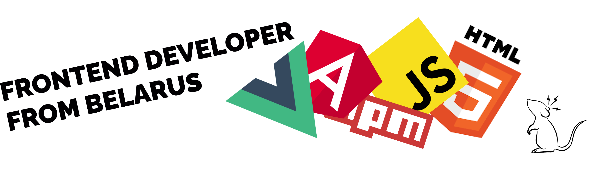
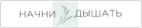
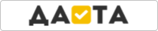
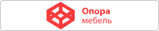
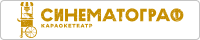

Hey there 🖐️!

I'm Alex. 
I currently work as a frontend developer 💻 in ITechArt Group. 
I'll be glad 😊 for you suggestions to join some interesting projects or startups🚀. 
Here is some information about me, my experience, projects, contacts and etc. 
Maybe you wanna see my CV so <a href="https://github.com/radio-mouse/radio-mouse/blob/master/CV.pdf">📝 here it is</a>. 
See ya 👋.

  
  
  
  
  
  

 
<ul>  
  <li>
    <a href="#projects">🧪 Projects</a>
    <ul>
      <li>
        <a href="#production">Production</a>
      </li>
      <li>
        <a href="#pets">Pets</a>
      </li>
    </ul>
  </li>
  <li>
    <a href="#stack">🔧 Stack</a>
  </li>
  <li>
    <a href="#exp">💼 Experience</a>
  </li>
  <li>
    <a href="#education">🎓 Education</a>
  </li>
  <li>
    <a href="https://github.com/radio-mouse/radio-mouse/blob/master/CV.pdf">📝 CV</a>
  </li>
</ul>
 
 
<h2 id="projects">🧪 Projects</h2>
<h3 id="production">Production</h3>
<h4>Frontend</h4>

  
  
  
  
  
  

<h4>Backend</h4>

  
  
  
  
  

<h3 id="pets">Pets</h3>

  

 
 
<h2 id="stack">🔧 Stack</h2>

  
   
  
   
  
   
  
   
  
   
  

 
 
<h2 id="exp">💼 Experience</h2>
<ul>
  <li>
    <b>Frontend Developer</b> 
    ItechArt Group 
    May 2021 – Present
  </li>
  <li>
    <b>Frontend Developer</b> 
    Narisuemvse 
    Oct 2020 – May 2021
  </li>
  <li>
    <b>PHP Developer</b> 
    Enterprisesoft 
    Mar 2020 – Oct 2020
  </li>
  <li>
    <b>Frontend Developer</b> 
    Freelance 
    Dec 2019 – Sep 2020
  </li>
  <li>
    <b>PHP Developer</b> 
    Freelance 
    Nov 2018 – Sep 2020
  </li>
  <li>
    <b>Control Room Operator</b> 
    OJSC "Naftan" 
    Aug 2011 – Mar 2020
  </li>
</ul>
 
 
<h2 id="education">🎓 Education</h2>
<ul>
  <li>
    <b>JavaScript Algorithms and Data Structures Certification</b> 
    freeCodeCamp 
    Issued Nov 2020 
    <a href="https://www.freecodecamp.org/certification/radiomouse/javascript-algorithms-and-data-structures">Certificate</a>
  </li>
  <li>
    <b>Responsive Web Design Certification</b> 
    freeCodeCamp 
    Issued Jan 2020 
    <a href="https://www.freecodecamp.org/certification/radiomouse/responsive-web-design">Certificate</a>
  </li>
  <li>
    <b>Bachelor of Engineering - BE, Computer Software Engineering</b> 
    Polotsk State University 
    2016 – 2021
  </li>
</ul>
 
 

Thanks for attention! You're awesome! 🙏👋

